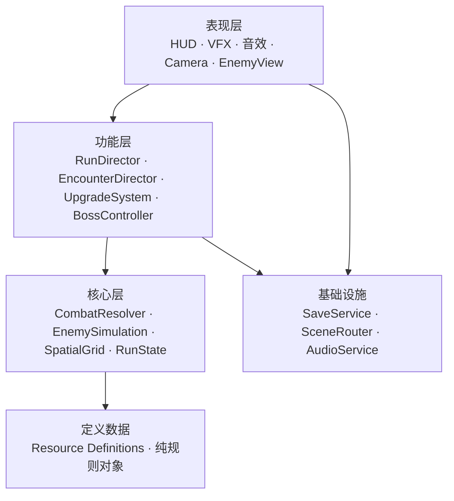

# 《三国：破阵斩将》Godot 技术架构

> 状态：架构草案 v0.1  
> 已确认引擎：Godot `4.7.stable.official.5b4e0cb0f`  
> 覆盖设计：[游戏设计文档](../game-design/README.md)  
> 关联 ADR：[0001](adr/0001-hybrid-enemy-representation.md)、[0002](adr/0002-run-scene-local-state-and-minimal-autoloads.md)、[0003](adr/0003-resource-driven-content-definitions.md)、[0004](adr/0004-mobile-rendering-target.md)

## 1. 前置条件与版本风险

已在本机验证引擎版本：`E:\Godot_v4.7\Godot_v4.7-stable_win64_console.exe --version` 返回 `4.7.stable.official.5b4e0cb0f`。本架构以该版本为基线，使用 Godot 4 的 `Resource`、强类型 GDScript、信号、AutoLoad、`MultiMeshInstance2D` 等能力。

开始编码前必须完成：

1. 创建最小 Godot 4.7 项目，并将项目配置纳入版本管理。
2. 默认选择 Godot 的 Mobile 渲染器（Vulkan），并设置横屏 16:9、1280 × 720 逻辑画布。
3. 检查 Godot 4.7 的 2D 渲染、输入、MultiMesh、移动端导出相关文档，并在参考/最低兼容档真机验证。

渲染器和设备档已由 ADR-0004 锁定；后续只在真机数据证明需要时调整 Compatibility 备选策略。

## 2. 技术需求基线

| ID | 来源 | 技术需求 | 架构归属 |
|---|---|---|---|
| TR-001 | 核心玩法 | 横屏双手输入、手动方向普攻、主动与无双 | 输入与玩家组件 |
| TR-002 | 战斗规则 | 三段连招、护体、护甲、穿透、击退、伤害公式 | 纯战斗领域逻辑 |
| TR-003 | 敌兵设计 | 刀/戟/弓/盾具有简单、可批量模拟的行为 | 敌军模拟与空间网格 |
| TR-004 | 玩法框架 | 剧情与无尽共用战斗规则，只替换关卡导演 | RunDirector 与 EncounterDirector |
| TR-005 | 长坂坡布局 | 一张有边界开放战场、按锚点生成敌军 | StageDefinition 与 SpawnDirector |
| TR-006 | Boss 设计 | 张郃三阶段、护卫上限、可读预警 | BossActor 与 BossController |
| TR-007 | 成长规则 | 经验合并、三选一、局内与局外状态分离 | UpgradeSystem、RunState、SaveService |
| TR-008 | 性能目标 | 大量敌军、对象池、低发热、无频繁创建销毁 | 混合实体架构与表现池 |
| TR-009 | 可维护性 | 避免巨型 GameManager、全局事件滥用和循环依赖 | 模块边界、AutoLoad、信号规则 |
| TR-010 | 质量保障 | 可测试数值规则、长期战斗稳定性、真机性能验收 | 测试与性能策略 |

## 3. 架构原则

1. **数据定义、局内状态和画面表现分离。**`Resource` 保存定义，`RunState` 保存本局状态，场景节点只承担交互与表现。
2. **玩家/Boss 组合化，普通兵批量化。**少量高价值 Actor 使用组件组合；大量杂兵不使用完整场景树。
3. **依赖向内。**UI、场景、音效和存档只能调用/订阅运行时系统；战斗公式和刷怪预算不依赖 UI 或场景节点。
4. **命令向下、事件向上。**父节点调用子组件的明确方法；状态变化由子组件以强类型 Signal 上报。高频战斗不逐条发全局 Signal。
5. **RunScene 拥有一局战斗。**局内状态、敌军池、导演、HUD 只活在当前 RunScene 中，结算后整体释放。

## 4. 分层与依赖方向



- 表现层不得修改伤害、经验或刷怪预算；只能将输入转换为命令，或展示已发生的结果。
- 功能层负责一局流程和用例编排，不保存独立于 RunState 的重复真相。
- 核心层应尽量使用 `RefCounted`、值对象、数组与明确参数，不依赖场景树。
- `Resource` 定义是只读模板；运行时强化通过 `RunState` 的修正值叠加，绝不回写模板。

## 5. 推荐目录

```text
res://
├─ assets/                  # 像素图、音频、字体、Shader、图集
├─ data/
│  ├─ heroes/               # HeroDefinition、赵云定义
│  ├─ enemies/              # EnemyDefinition、BossDefinition
│  ├─ skills/               # SkillDefinition
│  ├─ upgrades/             # UpgradeDefinition
│  └─ stages/               # StageDefinition、EncounterDefinition
├─ scenes/
│  ├─ app/                  # 启动、主菜单、结算
│  ├─ run/                  # RunScene、Stage、HUD
│  ├─ actors/               # Player、Boss、Elite 的完整场景
│  └─ ui/                   # 可复用 UI 场景
├─ scripts/
│  ├─ domain/               # 伤害、属性、升级抽取、运行时状态
│  ├─ systems/              # 敌军模拟、刷怪、战斗、经验、对象池
│  ├─ components/           # Player/Boss 的可组合组件
│  ├─ presentation/         # EnemyView、VFX、镜头、HUD 适配器
│  └─ shared/               # 只含无业务归属的小型工具
├─ autoload/                # 仅 SaveService、SceneRouter、AudioService
└─ tests/
   ├─ unit/
   ├─ integration/
   ├─ performance/
   └─ fixtures/
```

文件名使用 `snake_case.gd`，类名使用 `PascalCase`，资源/场景命名与其定义一致。禁止按“所有脚本都塞进 scripts”或“所有敌人都塞进 enemies”而缺少层级。

## 6. RunScene 场景树与模块职责

```text
RunScene (Node2D, 局内编排根节点)
├─ World (Node2D)
│  ├─ StageVisual (地图、边界、出生点可视化)
│  ├─ ActorLayer
│  │  ├─ PlayerActor (完整组合化场景)
│  │  └─ BossActor (按需实例化)
│  ├─ EnemyPresentationLayer (池化 EnemyView / 分块 MultiMesh)
│  ├─ PickupPresentationLayer
│  └─ VfxPool
├─ Runtime (Node)
│  ├─ RunDirector
│  ├─ EncounterDirector
│  ├─ EnemySimulation
│  ├─ SpatialGrid
│  ├─ CombatSystem
│  ├─ UpgradeSystem
│  ├─ PickupSystem
│  └─ PresentationPoolRegistry
└─ CanvasLayer
   ├─ RunHud
   ├─ UpgradeChoicePanel
   ├─ PausePanel
   └─ BossHud
```

`RunScene` 是编排器：在 `_ready()` 中通过显式 `@export` 依赖或唯一节点名完成连接；它不包含伤害公式、敌军 AI、UI 绘制或存档逻辑。

### 玩家与 Boss：组合式 Actor

`PlayerActor` 与 `BossActor` 是少量可接受完整节点开销的对象。根节点只连接组件，不把输入、移动、生命、攻击和表现写进一个脚本。

| 组件 | 玩家 | Boss | 职责 |
|---|---|---|---|
| InputComponent | 是 | 否 | 将触屏/UI 输入规范化为 `InputFrame`。 |
| MovementComponent | 是 | 是 | 根据命令和状态更新位移。 |
| HealthComponent | 是 | 是 | 生命、护体、伤害接收和死亡事件。 |
| CombatComponent | 是 | 是 | 创建攻击请求，不直接遍历场景树找目标。 |
| SkillComponent | 是 | 是 | 赵云技能 / Boss 招式的本地状态机。 |
| StateComponent | 可选 | 是 | Boss 阶段与招式状态；不用于每个杂兵。 |
| PresentationComponent | 是 | 是 | 动画、朝向、闪白、音画同步。 |

组件向根节点发出强类型状态事件，根节点调用组件公开方法。组件不能反向依赖根节点脚本，也不假设固定子树结构。

## 7. 普通敌军：模拟与表现分层

### 7.1 敌军模拟层

`EnemySimulation` 是 RunScene 内的唯一普通敌军真相来源。它以稳定实体 ID 管理密集数据：位置、速度、生命、兵种 ID、朝向、状态、冷却、目标和空间网格索引。

- 刀、戟、弓、盾的基础行为在批量循环中更新。
- 普通敌军不拥有各自的 `_process()`、`Timer`、复杂节点状态机或独立 `Area2D` 伤害系统。
- `SpatialGrid` 提供附近敌军查询、枪击贯穿、扇形攻击、箭雨和简化分离。
- `CombatSystem` 从空间网格查询候选目标，计算伤害后回写模拟数据。
- 敌军死亡、掉落和无双能量通过本帧事件缓冲批量提交；不为每个死亡逐条广播全局 Signal。

### 7.2 表现层

`EnemyPresentationLayer` 只将模拟状态映射为可见对象：

- 近处、正在受击的普通敌人绑定池化 `EnemyView`（Sprite、动画、阴影）；具名精英使用完整 Actor，生命信息只进入顶部敌将状态栏。
- 远处普通敌军可使用更低频的 View 更新；密集同类敌军在性能里程碑后再切换为分块 `MultiMeshInstance2D`。
- 每个模拟 ID 最多绑定一个表现代理；代理解绑后必须清除类型、受击闪白、动画、回调和空间引用。
- `MultiMeshInstance2D` 只承担同材质批量视觉，不承担碰撞、AI 或逐实例战斗真相。

### 7.3 为什么不是完整 ECS 或每兵一个 Scene

完整 ECS 对首个 Godot 原型的开发成本偏高；每兵一个 Scene 又会让节点、物理、Signal 和销毁成本随兵海失控。故采用“**数据导向杂兵模拟 + Godot 组合式高价值 Actor**”的混合方案。详见 [ADR-0001](adr/0001-hybrid-enemy-representation.md)。

## 8. 数据定义、运行状态与存档

### 8.1 Resource 定义

| 定义 | 包含内容 | 不能包含 |
|---|---|---|
| HeroDefinition | 基础属性、武器、技能引用、初始强化池 | 当前生命、当前等级、冷却剩余。 |
| SkillDefinition | 目标规则、倍率、冷却、视觉/音效引用 | 某次施放目标或运行时计时器。 |
| EnemyDefinition | 属性、行为类别、经验、表现引用 | 当前实体位置或死亡状态。 |
| BossDefinition | 阶段阈值、招式表、护卫规则 | 当前阶段与当前护卫数。 |
| UpgradeDefinition | 前置条件、叠加上限、运行时修正描述 | 已被哪一局玩家选择。 |
| StageDefinition | 地图边界、出生锚点、环境资源 | 当前时间或存活敌人数。 |
| EncounterDefinition | 剧情时间线、刷怪预算、兵种权重 | 当前随机种子结果。 |

### 8.2 局内状态

`RunState` 是单局唯一状态聚合，至少包含：模式、随机种子、计时、玩家运行时属性、已选强化、经验、无双能量、关卡事件进度、敌军模拟数据和结算统计。

`ProfileState` 只包含设置、军功、已解锁内容和章节进度。`RunResult` 是结算时从 `RunState` 提取的不可变摘要；`SaveService` 只接收 `RunResult` 与 Profile 更新命令，不读取活跃场景节点。

## 9. 模块所有权与公开边界

| 模块 | 独占拥有 | 对外公开 | 不可做的事 |
|---|---|---|---|
| RunDirector | RunState、开始/暂停/结算状态 | `start_run()`、`pause()`、`finish_run()`、低频状态信号 | 不直接计算伤害或遍历敌军。 |
| EncounterDirector | 时间线、刷怪预算、遭遇进度 | `tick()`、`next_spawn_requests()` | 不实例化 Sprite 或修改 HUD。 |
| EnemySimulation | 普通敌军实体数据与 ID 生命周期 | 查询、生成、移除、帧事件缓冲 | 不访问 UI、存档或全局单例。 |
| SpatialGrid | 实体位置索引 | 半径/扇形/线段查询 | 不决定伤害或表现。 |
| CombatSystem | 伤害解析、命中和击退结果 | `resolve_attack(request)` | 不直接播放特效或更新文本。 |
| UpgradeSystem | 三选一抽取和运行时属性修正 | `draft_choices()`、`apply_choice()` | 不保存永久军功。 |
| PresentationPoolRegistry | View、VFX、掉落表现池 | `acquire()`、`release()` | 不成为敌军真实状态来源。 |
| RunHud | 生命、经验、Boss 与选择面板 | 显示方法、输入信号 | 不计算数值或改变敌军状态。 |
| SaveService | ProfileState 序列化和迁移 | `load_profile()`、`save_profile()`、`apply_result()` | 不保存活跃 RunState。 |

公开接口使用小而明确的参数对象，例如 `AttackRequest`、`DamageResult`、`SpawnRequest`、`RunResult`；禁止用无类型 `Dictionary` 在模块间传递核心战斗数据。

## 10. 命令、Signal 与事件缓冲

| 通信类型 | 适用场景 | 示例 |
|---|---|---|
| 直接方法调用 | 父节点命令子组件；同步、局部操作 | RunDirector 调用 EncounterDirector 更新。 |
| 局部强类型 Signal | 已发生的低频状态变化 | HealthComponent 的 `died`、HUD 按钮点击。 |
| 帧事件缓冲 | 高频、批量战斗结果 | 普通敌军死亡、命中、经验合并、飘字请求。 |
| AutoLoad 通信 | 跨场景且低频的应用级操作 | 结算后保存 Profile、场景切换、全局音量。 |

具体规则：

- Signal 使用过去式、强类型名称，例如 `health_changed(current: int, maximum: int)`、`run_finished(result: RunResult)`。
- Signal 不用于命令下级行为；例如 `CombatSystem` 不通过“请攻击”信号命令 PlayerActor。
- 禁止把每次普通敌军移动、命中或死亡连接到全局事件总线。
- 动态连接必须在解绑/回收时断开；避免捕获局部变量的 lambda 留下幽灵回调。
- UI 仅订阅聚合状态，例如经验总量变化、Boss 阶段变化、选择面板打开。

## 11. AutoLoad 边界与启动顺序

首个版本只允许三个 AutoLoad：

| 顺序 | AutoLoad | 职责 | 禁止承担 |
|---:|---|---|---|
| 1 | SaveService | 读取/写入 ProfileState、设置与版本迁移 | 活跃战斗状态、UI。 |
| 2 | AudioService | 全局音量、跨场景音乐与音效通道 | 战斗规则或场景转场决策。 |
| 3 | SceneRouter | 菜单、RunScene、结算场景的切换 | 保存业务、战斗数据、直接操作当前场景子节点。 |

- AutoLoad 的 `_ready()` 只准备轻量默认状态，禁止访问排在其后的 AutoLoad 或当前场景。
- 不创建 `GameManager`、`EnemyManager`、`UIManager` 等包揽局内状态的单例。
- 不引入全局 EventBus；首个版本的跨场景需求由 `RunScene.run_finished(result)` → `SceneRouter` → `SaveService` 的明确链路完成。
- 需要暂停时，RunDirector 管理局内暂停状态；AudioService 是否继续播放由显式调用决定，不依赖隐式全局副作用。

## 12. 关键数据流

### 12.1 一帧战斗更新

```text
触摸/UI 输入
→ InputComponent 生成 InputFrame
→ PlayerActor 更新移动与连招状态
→ CombatComponent 创建 AttackRequest
→ CombatSystem + SpatialGrid 解析命中
→ EnemySimulation / HealthComponent 应用 DamageResult
→ 帧事件缓冲汇总死亡、经验、VFX 请求
→ UpgradeSystem / PickupSystem 更新 RunState
→ PresentationLayer 与 HUD 读取快照并显示
```

### 12.2 普通敌军死亡与升级

```text
EnemySimulation 标记死亡
→ 释放实体 ID，写入 EnemyDeathEvent
→ PickupSystem 合并经验包与无双能量
→ RunState 经验变化
→ 达到阈值时 UpgradeSystem 生成三选一
→ RunDirector 暂停局内逻辑并通知 UpgradeChoicePanel
→ 玩家选择后 UpgradeSystem 应用修正，RunDirector 恢复
```

### 12.3 Boss 阶段

```text
Boss HealthComponent 生命跨越阈值
→ BossActor 本地 Signal 上报 BossController
→ BossController 更新阶段、清理旧预警、创建有限护卫 SpawnRequest
→ RunHud 更新阶段提示
```

### 12.4 结算与存档

```text
Boss 死亡 / RunState 失败
→ RunDirector 冻结局内状态并生成 RunResult
→ RunScene 发出 run_finished(result)
→ SceneRouter 调用 SaveService.apply_result(result)
→ SaveService 写入 ProfileState
→ SceneRouter 进入结算场景
```

## 13. 对象池与性能策略

| 对象 | 真实状态位置 | 生命周期策略 |
|---|---|---|
| 普通敌军 | EnemySimulation 数组/槽位 | 复用实体 ID；死亡时失活，不实例化/销毁完整敌军场景。 |
| EnemyView | PresentationPoolRegistry | 按兵种池化，绑定/解绑模拟 ID。 |
| 投射物与预警 | Combat/Presentation 数据 + VFX 池 | 批量更新、回收；不使用每实例 Timer。 |
| 经验表现 | PickupSystem 聚合数据 + 表现池 | 多个死亡合并为较少经验包。 |
| 玩家/Boss/精英 | 完整 Actor 场景 | 数量极少，可按场景生命周期创建。 |

### 原型性能里程碑

| 阶段 | 逻辑普通敌军 | 高保真 Actor | 可见表现代理 | 验收 |
|---|---:|---:|---:|---|
| 功能原型 | 120 | 玩家 + 至多 4 精英 + Boss | 60 | 操控、伤害、升级正确。 |
| 压测原型 | 300 | 不超过 8 | 100 | 20 分钟无泄漏、无明显生成卡顿。 |
| 移动端目标 | 500 以上，按真机调整 | 不超过 12 | 150 左右或分块批量渲染 | 目标设备持续战斗可接受的帧率与温度。 |

这些不是“保证数字”，而是逐阶段压测目标。若达不到，应先减少高频场景节点、物理查询、独立材质、过量透明特效和每帧分配，再考虑降低敌军设计密度。

## 14. 实施顺序

1. 创建 Godot 4.x 项目，固定版本、输入映射、横屏分辨率与像素缩放策略。
2. 建立 Resource 定义与纯领域逻辑：属性、伤害、经验、三选一、RunState。
3. 搭建 RunScene、赵云组合式 Actor、边界与基础 HUD；先用色块验证输入。
4. 实现 EnemySimulation、SpatialGrid、SpawnDirector 和基础敌兵；先验证 120 个逻辑敌军。
5. 接入对象池、经验合并、升级面板、场地锚点与长坂坡时间线。
6. 接入夏侯恩、淳于导、张郃与 Boss 阶段；验证无闪避安全规则。
7. 加入真实像素表现、VFX、音效和移动端性能档位；逐步压测到目标敌军规模。
8. 最后接入 ProfileState、军功、章节解锁与结算保存。

每一步都应有可运行场景、自动测试和真机验收，不进行“大量系统并行但没有可玩验证”的开发。

## 15. 未决问题

| ID | 问题 | 影响 | 解决时机 |
|---|---|---|---|
| TA-01 | Compatibility 渲染器是否需要成为正式备选路径 | 低端兼容范围、测试成本 | 最低兼容档真机压测后。 |
| TA-02 | 20 分钟无尽模式的终局是 Boss 结算还是无限延续 | EncounterDirector、结算 | 实现无尽模式前。 |
| TA-03 | 是否需要通用兵法/副技能槽 | UpgradeSystem、HUD、数据定义 | 第二名武将之前。 |
| TA-04 | MultiMesh 是否能满足像素敌军动画与可读性 | 表现层、性能 | 压测原型阶段。 |
| TA-05 | 局内 RunState 是否需要中途存档 | 序列化、暂停恢复 | 首个垂直切片之后。 |
